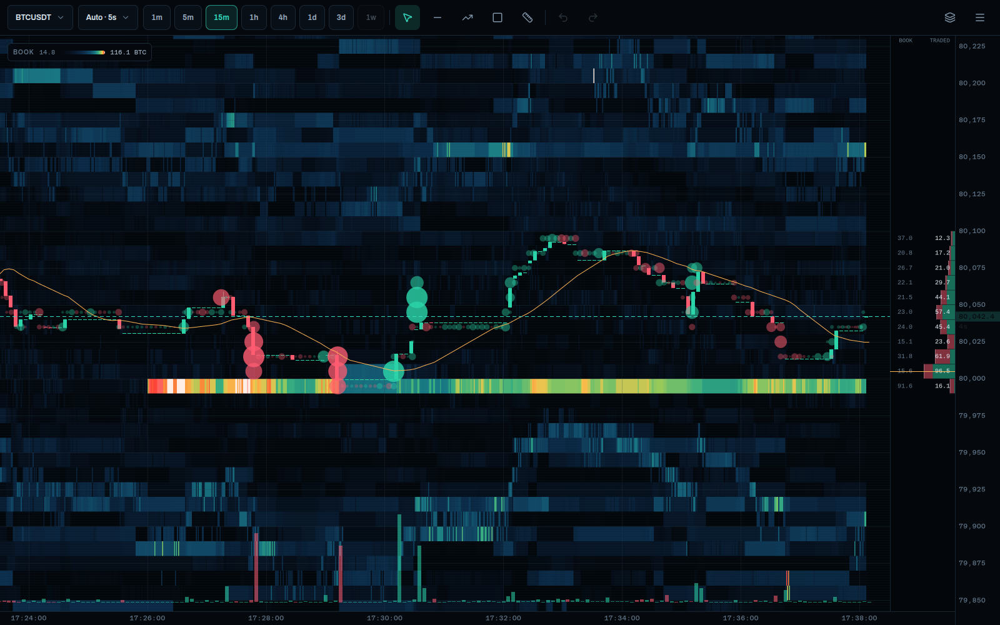

<p align="center">
  
</p>

<h1 align="center">Fathom</h1>

<p align="center">
  <strong>Order book liquidity, recorded second by second.</strong><br>
  Resting depth becomes a heat map you can pan through: bright bands are walls
  of limit orders, bubbles are the trades that ate them. Candles ride on top, so
  you see whether a wall held or broke.
</p>

<p align="center">
  
  ·
  
  ·
  
  ·
  
  ·
  
</p>

<p align="center">
  <a href="https://giovani-freitag.github.io/fathom/"><strong>Open the live demo →</strong></a><br>
  <sub>Your browser becomes the collector. No backend, no signup.</sub>
</p>

<p align="center">
  
</p>

Candles can be downloaded for any past day. The order book cannot — no venue
sells yesterday's resting depth, and nothing reconstructs it. An hour that was
not recorded is gone. Fathom exists to be running before you need the data.

## ✨ Features

- 🌊 **Depth heat map** — every resting price level, once per second, as colour
- 🕯️ **Candles over liquidity** — open/high/low/close derived from the recorded book
- 🫧 **Aggressor bubbles** — trades sized by volume, coloured by which side crossed
- 📊 **Depth ladder** — resting size and traded volume per price, beside the chart
- 🎚️ **Two-cut colour map** — mute the background churn so real walls stand alone
- 🕳️ **Honest gaps** — stretches that were not recorded are drawn as holes, never smoothed
- 📱 **Touch first** — one finger pans, two pinch both axes, the axes are scale handles
- ⚡ **Live tail** — a WebSocket appends each new second without refetching the window
- 🎛️ **Recording control** — pick which contracts record and cap the disk, from the chart itself
- 🔌 **Venue-neutral core** — the exchange lives behind a driver; Binance USD-M is the first
- 🌐 **Runs with no backend** — the same collector registers as a Web Worker and records into IndexedDB

## 🚀 Run it locally

```bash
git clone https://github.com/giovani-freitag/fathom.git
cd fathom
npm install
cp .env.example .env          # set POSTGRES_PASSWORD

docker compose up -d          # TimescaleDB
npm run migrate
npm run build

npm run collect &             # start recording — this is the part that must not stop
npm run gateway               # http://localhost:8787
```

The chart only covers time the collector was running. Leave it up.

## 📚 Docs

- [Architecture](docs/architecture.md) — the three processes and how a frame reaches the screen
- [Data model](docs/data-model.md) — schema, grids, and what each column means
- [Operations](docs/operations.md) — running it as a service, disk, sharing it
- [Decisions](docs/adr/) — why the design is what it is, with the measurements behind it
- [Demo](demo/) — the browser-only build, published from `main` to GitHub Pages

## License

MIT © [Giovani Freitag](https://github.com/giovani-freitag)
