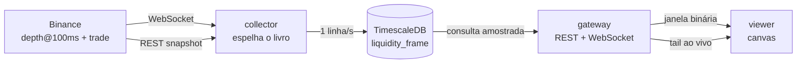

# Arquitetura

Três processos, um banco. Cada um tem uma responsabilidade que os outros não
compartilham.

## Por que três processos

O coletor nunca pode ficar bloqueado por um leitor. Se a interface derruba o
processo que grava, o buraco na base é permanente — e é a única coisa no sistema
que não dá para refazer. Separar garante que abrir dez abas do gráfico não
custa um segundo de gravação.

## Limites do gateway

Cada socket ao vivo abre seu próprio cursor contra o mesmo banco em que o coletor
escreve, então o número deles é limitado. Ligado a um endereço de LAN, algumas
abas esquecidas são normais e um cliente descontrolado não pode disputar espaço
com a gravação.

## O gateway lê do arquivo, não do coletor

O tempo real chega ao navegador por um *tail* do banco, não por um túnel a partir
do coletor. Custa até um segundo de latência e paga duas coisas:

- O que aparece na tela existe no disco. Um frame nunca é desenhado e depois
  perdido num restart.
- Histórico e tempo real percorrem o mesmo caminho de código. Não há um
  renderizador para dados vivos e outro para dados velhos divergindo com o tempo.

## Reconstrução do livro

A Binance manda um snapshot completo por REST e um fluxo de mudanças por
WebSocket. Cada mudança carrega o identificador final da mudança anterior, então
uma mensagem perdida é **detectável** — e é isso que separa um livro correto de um
livro que diverge em silêncio para sempre.

Ao detectar a quebra, o coletor descarta o livro local e reconstrói. Nada é
gravado no intervalo, e o intervalo é registrado como lacuna.

### O reparo profundo

O snapshot REST devolve no máximo 1000 níveis por lado — cerca de ±200 USDT no
BTC, enquanto a janela gravada é ±2% (±1600 USDT). O resto da faixa só se preenche
conforme as mudanças chegam.

Isso deixa um erro permanente: um nível parado longe do meio, criado antes de a
gravação começar e nunca mais tocado, jamais apareceria. E é exatamente ali que
moram as paredes que interessam.

Por isso, a cada cinco minutos um snapshot novo é mesclado **só dentro da faixa
que ele próprio cobre**. Fora dela o conhecimento local é preservado. Substituir o
livro inteiro jogaria fora justamente a profundidade que o produto existe para
mostrar.

### Quanto tempo o livro leva para encher

Medido na base, contando faixas de preço preenchidas depois de uma
ressincronização:

| Segundos após retomar | Faixas preenchidas |
| --- | --- |
| 1 | 173 de 316 (55%) |
| 10 | 260 de 317 (82%) |
| 60 | 311 de 317 (98%) |
| 300 | 317 de 317 (100%) |

O snapshot REST entrega pouco mais da metade da janela gravada; o resto chega
pelo fluxo de mudanças em cerca de um minuto.

**Consequência para a leitura:** no primeiro minuto após qualquer retomada, uma
parede distante que já existia antes ainda não apareceu. Ela vai surgir no
gráfico como se tivesse sido colocada naquele instante. Esse minuto sempre vem
logo depois de uma faixa de lacuna — que já é desenhada — então na prática o
próprio gráfico marca onde não confiar.

## Amostragem em janelas largas

Duas semanas a uma coluna por segundo são 1,2 milhão de colunas para uma tela de
1500 pixels. O servidor não agrega: ele **amostra**, uma sonda de índice por coluna
de saída, via `generate_series` com `LATERAL`.

Amostrar em vez de mediar é defensável porque liquidez parada é persistente — uma
parede que ficou dez minutos aparece em qualquer amostra daquele intervalo. O que
se perde são paredes mais curtas que o passo de amostragem, e o passo vigente fica
visível no cabeçalho da interface.

O passo nunca fica mais fino que a grade gravada. Pedir mais colunas do que há
frames deixaria buckets vazios entre os reais, e o renderizador desenharia um
pente de colunas em branco.

Medido contra o arquivo:

| Janela pedida | Profundidade | No fio | Agressões |
| --- | --- | --- | --- |
| 15 min | 0,15 s | 303 KB | 0,01 s |
| 1 h | 0,24 s | 906 KB | 0,01 s |
| 2,4 h | 0,24 s | 1,3 MB | 0,01 s |

Dez vezes mais janela custa 1,6 vezes mais tempo: a conta acompanha o número de
colunas devolvidas, não a largura do intervalo — que é exatamente o ponto de
sondar por índice em vez de varrer. As agressões ficam constantes porque as views
contínuas já as agregaram.

## Execuções

As agressões já chegam agregadas na mesma grade dos frames: o coletor soma por
(segundo, faixa de preço) antes de escrever. Um perpétuo líquido imprime ~100
negócios por segundo, duas ordens de grandeza mais do que qualquer zoom do mapa
consegue distinguir.

Cada campo do agregado rola para uma grade mais grossa sem perda — as quantidades
e a contagem somam, e o maior negócio individual usa máximo. Uma impressão grande
continua legível depois da agregação em vez de dissolver entre as vizinhas.
Agregados contínuos de 1 minuto e 1 hora pré-computam os dois zooms mais largos.

## O renderizador

O campo de profundidade é pintado uma vez numa imagem cujos eixos são tempo e
faixa de preço. Pan e zoom viram um único `drawImage` escalado, que o navegador
entrega ao compositor. Pintar por pixel de tela a cada gesto repintaria centenas
de milhares de pixels por quadro.

Duas telas empilhadas: profundidade embaixo, cromo em cima. Mover o cursor repinta
só a camada fina.

### Um segundo novo não reconstrói a janela

O campo absorve os frames que chegam ao vivo em vez de ser refeito. Medido numa
janela de uma hora, antes e depois:

| | Repinturas em 12s | Custo total |
| --- | --- | --- |
| Reconstruindo | 24 de 712 mil pixels | 501 ms |
| Absorvendo | 12 de uma coluna | 0,8 ms |

Meio segundo a cada doze era 4% da thread principal gasta redesenhando dados que
não mudaram. No desktop isso passava despercebido; num celular, três a cinco vezes
mais lento, vira engasgo no meio de um pinch.

O campo recusa a absorção e pede reconstrução quando a grade muda, quando as
colunas de folga acabam, ou quando o preço sai da faixa já pintada.

### Camadas

O coordenador não desenha nada: resolve o layout, o campo e os ticks, e entrega
tudo num contexto compartilhado para cada camada — lacunas, grade, perfil,
agressões, linha de preço, eixos, crosshair. Os ticks são resolvidos uma vez e
compartilhados, porque uma linha de grade e seu rótulo discordarem por um pixel é
o tipo de defeito que ninguém consegue explicar depois.

## Como a árvore está organizada

O topo divide por **quem executa**, não por camada. É a divisão que mais
restringe: o navegador não pode importar o driver do PostgreSQL, e o Node não tem
DOM. Com essa pergunta no topo, a fronteira vira estrutura em vez de disciplina.

| Pasta | Executa em | Contém |
| --- | --- | --- |
| `shared/` | os três | tipos do fio, codec binário, matemática de faixas |
| `database/` | Node | conexão, escrita, leitura |
| `server/` | processo do gateway | rotas, schemas, tail ao vivo |
| `workers/` | processo do coletor | espelho do livro, corretora, gravação |
| `app/` | navegador | controller, canvas, React |

Dentro de cada um, duas pastas onde a divisão é real: `core/` para lógica sem
dependência externa — testável sem subir banco nem DOM — e `services/` para o
que fala com o mundo. `app/` acrescenta `painting/`, `react/` e `ui/`.

Estado no `app/` vive em `ObservableStore` dentro de `core/`, não em `useState`.
O `ChartController` decide tudo: o que carregar, quando recarregar, o que a
janela mostra. React apenas lê, através de `react/use-store.ts`.

O coletor e o gateway são pares: nenhum importa do outro. O que os dois usam —
o banco — é um vizinho dos dois, não uma pasta dentro de um deles. Assim as setas
só apontam para baixo e não é preciso nenhuma regra para mantê-las assim.
