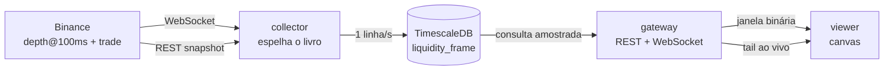

# Arquitetura

Três processos, um banco. Cada um tem uma responsabilidade que os outros não
compartilham.

## Por que três processos

O coletor nunca pode ficar bloqueado por um leitor. Se a interface derruba o
processo que grava, o buraco na base é permanente — e é a única coisa no sistema
que não dá para refazer. Separar garante que abrir dez abas do gráfico não
custa um segundo de gravação.

## O gateway lê do arquivo, não do coletor

O tempo real chega ao navegador por um *tail* do banco, não por um túnel a partir
do coletor. Custa até um segundo de latência e paga duas coisas:

- O que aparece na tela existe no disco. Um frame nunca é desenhado e depois
  perdido num restart.
- Histórico e tempo real percorrem o mesmo caminho de código. Não há um
  renderizador para dados vivos e outro para dados velhos divergindo com o tempo.

## Reconstrução do livro

A Binance manda um snapshot completo por REST e um fluxo de mudanças por
WebSocket. Cada mudança carrega o identificador final da mudança anterior, então
uma mensagem perdida é **detectável** — e é isso que separa um livro correto de um
livro que diverge em silêncio para sempre.

Ao detectar a quebra, o coletor descarta o livro local e reconstrói. Nada é
gravado no intervalo, e o intervalo é registrado como lacuna.

### O reparo profundo

O snapshot REST devolve no máximo 1000 níveis por lado — cerca de ±200 USDT no
BTC, enquanto a janela gravada é ±2% (±1600 USDT). O resto da faixa só se preenche
conforme as mudanças chegam.

Isso deixa um erro permanente: um nível parado longe do meio, criado antes de a
gravação começar e nunca mais tocado, jamais apareceria. E é exatamente ali que
moram as paredes que interessam.

Por isso, a cada cinco minutos um snapshot novo é mesclado **só dentro da faixa
que ele próprio cobre**. Fora dela o conhecimento local é preservado. Substituir o
livro inteiro jogaria fora justamente a profundidade que o produto existe para
mostrar.

## Amostragem em janelas largas

Duas semanas a uma coluna por segundo são 1,2 milhão de colunas para uma tela de
1500 pixels. O servidor não agrega: ele **amostra**, uma sonda de índice por coluna
de saída, via `generate_series` com `LATERAL`.

Amostrar em vez de mediar é defensável porque liquidez parada é persistente — uma
parede que ficou dez minutos aparece em qualquer amostra daquele intervalo. O que
se perde são paredes mais curtas que o passo de amostragem, e o passo vigente fica
visível no cabeçalho da interface.

O passo nunca fica mais fino que a grade gravada. Pedir mais colunas do que há
frames deixaria buckets vazios entre os reais, e o renderizador desenharia um
pente de colunas em branco.

## Execuções

As agressões já chegam agregadas na mesma grade dos frames: o coletor soma por
(segundo, faixa de preço) antes de escrever. Um perpétuo líquido imprime ~100
negócios por segundo, duas ordens de grandeza mais do que qualquer zoom do mapa
consegue distinguir.

Cada campo do agregado rola para uma grade mais grossa sem perda — as quantidades
e a contagem somam, e o maior negócio individual usa máximo. Uma impressão grande
continua legível depois da agregação em vez de dissolver entre as vizinhas.
Agregados contínuos de 1 minuto e 1 hora pré-computam os dois zooms mais largos.

## O renderizador

O campo de profundidade é pintado uma vez numa imagem cujos eixos são tempo e
faixa de preço. Pan e zoom viram um único `drawImage` escalado, que o navegador
entrega ao compositor. Pintar por pixel de tela a cada gesto repintaria centenas
de milhares de pixels por quadro.

Duas telas empilhadas: profundidade embaixo, cromo em cima. Mover o cursor repinta
só a camada fina.

## Camadas do viewer

O padrão é o mesmo de outros projetos da casa:

- `core/` — TypeScript sem framework. Serviços, controladores e domínio. Testável
  fora de um DOM.
- `react/` — a ponte, e nada mais. `useStore` liga um `ObservableStore` ao
  `useSyncExternalStore`; `useKernel` entrega o contêiner de serviços.
- `ui/` e `features/` — componentes.

Estado vive em `ObservableStore` dentro do core, não em `useState`. O
`ChartController` decide tudo: o que carregar, quando recarregar, o que a janela
mostra. React apenas lê.
