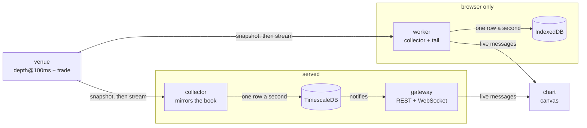

# Architecture

Fathom is registered twice. On a server it is three processes around a database;
in a page it is one worker beside the tab that opened it. Both registrations run
the same collector, the same tail, and the same chart — only the drivers differ.

## Why the server splits into two processes

The collector can never be blocked by a reader. If the interface can take down
the process that writes, the hole it leaves is permanent — recorded book history
is the one thing in the system that cannot be made again. Splitting them means
ten open tabs cost no recorded second.

In a page that separation is unnecessary and impossible: there is one worker, and
if it stops the recording stops with it. That is the honest trade a demo makes.

## Both halves read from the archive, never from the collector

Live data reaches a chart by tailing what was stored, not by a tunnel out of the
collector. It buys two things:

- What appears on screen exists in storage. A frame is never drawn and then lost
  to a restart.
- History and live data travel the same code path. There is no renderer for
  fresh data and another for old data drifting apart.

## One tail, two transports

The tail is shared code with no clock of its own. It holds a reader's cursors and
answers one question — what has been recorded that this reader has not seen —
emitting one message union that every transport carries.

Who advances it differs. On a server the collector announces a write on a
database channel and the gateway catches the tails following that contract up; in
a page the worker's own write does it directly. Both keep a slow interval behind
that, so a missed trigger costs latency and never data. It is also why the
announcement names the contract and never carries the rows: a cursor cannot be
made wrong by a message that was dropped.

The message type is the same on both wires. A socket writes a window of frames as
bytes — two typed arrays per column, which JSON would spell out in digits — and
everything else as text; a worker hands the whole thing over by structured clone.

## Rebuilding the book

The venue serves a full ladder over REST and a stream of changes over WebSocket.
Each change carries the previous change's final identifier, so a dropped message
is **detectable** — that is what separates a correct book from one that diverges
in silence forever.

On a break the collector discards its local book and rebuilds. Nothing is
recorded in the meantime, and the meantime is recorded as a gap.

### The deep repair

A REST ladder returns at most a thousand levels a side — roughly ±200 quote units
on BTC, against a recorded band of ±2%. The rest of the band fills only as
changes arrive.

That leaves a permanent error: a resting level far from the touch, placed before
recording began and never touched again, would never appear. That is exactly
where the walls worth seeing live.

So every five minutes a fresh ladder is merged **only inside the range it covers
itself**. Outside it, local knowledge is kept. Replacing the whole book would
throw away the depth the product exists to show.

### How long the book takes to fill

A ladder covers roughly half the recorded band immediately; the rest arrives with
the change stream, and the far edges take about a minute to appear. The exact
shape depends on how wide the band is against the venue's ladder limit, and on
how busy the contract is.

**What that means for a reader:** in the first minute after any resume, a distant
wall that already existed has not appeared yet. It will arrive on the chart as if
it had been placed at that instant. That minute always follows a gap band, which
is already drawn — so the chart marks where not to trust it.

## Reading a wide window

Two weeks at a column a second is over a million columns for a screen fifteen
hundred pixels wide. The server does not aggregate: it **samples**, keeping the
first frame of each time bucket in a single range scan.

The shape matters more than it looks. A lateral probe per bucket is fast against
an uncompressed chunk and has to decompress a whole batch against a columnar one,
so the same query degrades by orders of magnitude the moment history ages past
the compression policy. Scanning once costs the same on either kind of chunk.
ADR 0005 records the measurement that settled it.

Sampling rather than averaging is defensible because resting liquidity persists —
a wall that stood for ten minutes appears in any sample of that stretch. What is
lost is a wall shorter than the sampling step, and the step in force is shown in
the interface header.

The step is never finer than the recorded grid. Asking for more columns than
there are frames would leave empty buckets between the real ones, and the
renderer would draw a comb of blank columns.

Both the time and the size of a read are governed by the column budget, not by
the width of the window. Past the point where a window holds more seconds than
the budget allows columns, asking for ten times the history costs almost nothing
more — which is the property that makes a week as affordable to open as an hour.

## Bars

A bar is not a fold of the frames the chart already holds. Those are sampled to
fit a surface — one column per plot pixel — so binning them makes the bar a
property of the browser window: the same viewport on a phone and on a desktop
produced bars several times apart, and an average over them would have differed
between two screens showing the same thing.

So bars come from a declared interval against the archive, on a closed ladder of
rungs chosen from the viewport's span alone. Above a minute the archive holds
them pre-grouped; below it, a scan that names only the two price columns answers
directly — and on a columnar chunk that scan never fetches the depth arrays at
all, which is why it needs no aggregate of its own.

Every bar carries what built it: how many frames a whole bucket of its width
holds, how many actually landed, and whether the bucket can still grow. Those
three facts are the difference between a bar the collector missed seconds of, a
bar still being written, and a whole one — and without them a chart draws all
three identically and claims continuous price through time nothing was recorded
in. A bucket with no frames at all is omitted rather than zero-filled, and the
stretch it left is marked.

They are bars of the **book mid**, not of a traded price. A traded close is
derivable from the execution grid to within a hundredth of a percent, so this is
a choice: the mid is what the recording is of, and it is defined in every second
the collector saw, including the ones nothing traded in.

## Indicators

An indicator is a pure function from bars to vertices **in data space**. It never
receives a drawing context and never converts a value to a pixel — the host owns
that function, so panning re-projects a plan it already holds instead of asking
the indicator for a new one. That is what keeps whoever wrote it off the gesture
path entirely, and it is the property that will make it safe to run one nobody
here wrote.

A plan carries more than lines. It can shade a region between two of its own
series, mark a constant value, and draw a histogram that changes colour where it
crosses a baseline. Those are not conveniences: a channel with no fill reads as
two unrelated lines, and a threshold nobody can name is a decoration.

A plan says whether it converged. An indicator asks for warm-up bars ahead of the
window, the archive answers with what it could supply, and a series seeded from
less than it wanted is drawn dashed — because a seeded average looks exactly
like a settled one. Adding an indicator that reaches further back than the loaded
window does is a reason to fetch again, not a reason to seed from what is there.

Where a reading has a conventional definition, the definition is what ships.
Simple and exponential averages, relative strength, the Bollinger channel and
the true range are each checked against a transcription of the published formula
and agree with it to floating-point precision — the seed included, which is the
part implementations usually differ on and the part a reader comparing two
screens sees first. An exponential average is seeded with the simple mean of its
first period, not with its first bar; Wilder's smoothing is seeded the same way.

Anything read off one figure per bar takes that figure as a parameter: the
close, one of the other three corners, or one of the conventional blends of
them. Everything else — the channel of extremes, the range of a bar, where a
close sits inside a range — reads the bar's own extent and has no such choice.

A bar also carries what changed hands inside it, and by which side crossed the
spread. That comes from the executions rather than from the book, so it is read
with a scan of its own: the two are stored apart and rolled up apart, and a join
would tie each to whichever grid the other happened to need. A bucket the book
was recorded through with nobody trading counts as nothing traded, which is a
different fact from a bucket that was never recorded.

Knowing the side is what the archive has that a tape of prints does not, so
volume is offered both ways: the total, which is what a reader expects to see,
and the two sides drawn against each other from nought, where a bar of eight
bought and two sold no longer looks like its opposite.

Every indicator restarts at a break in the recording rather than carrying state
across it. Smoothing through unrecorded time invents a trend, and once it is a
line on a screen it is indistinguishable from a real one. The rule is testable
without knowing any of the formulas: what is drawn after a gap must be exactly
what would be drawn if the bars before it had never existed.

### Panes

A quantity that is not a price cannot share an axis with one. An oscillator
bounded to nought and a hundred, plotted against a price axis, is a flat line at
the bottom of the screen. So a plan declares its scale, and anything that is not
a price is given a band of its own below the chart, with its own range and its
own two labels in the gutter.

The stack is what the containment is built around. The outer clip keeps every
layer out of the axis gutters. An inner clip keeps everything that reads as a
price inside the pane that has a price axis — without it, a candle at the edge of
the band draws down through the oscillator beneath it and reads as part of that
oscillator's line. Each band then clips itself. Enforcing all of this in the
renderer rather than trusting each painter is what makes the guarantee worth
anything.

Gaps and the time grid are the exception, and deliberately so: they belong to
time rather than to price, so they cross every band.

### Sharing a band

Each reading that needs a band gets one of its own, and any of them can be moved
into another's. That move is the whole reason for having two copies of one
oscillator: the same reading at a fast and a slow period says nothing when the
two sit in separate bands against separate ranges, and everything when they sit
on one ruler and cross each other. A band scales to cover everything drawn in
it, and only a band on the same kind of scale is offered — squashing a
nought-to-hundred reading in beside a signed one leaves both unreadable.

### Telling two apart

The same indicator added twice at different settings is the ordinary case, not an
edge one. Each copy carries a colour of its own, assigned from the first one
nothing else is using, and that colour is what the legend beside it is marked
with. Only what the indicator drew in its own colour moves; an accent the author
chose to differ — a dashed midline, a signal line, the shading of a band — says
something about the reading and is left alone.

The legend sits at the top of the band its indicator is drawn in, carries the
parameters it was run with and what each of its series reads under the pointer,
and holds the controls that hide, retune or remove it. Hiding is distinct from
removing: the parameters survive, and a band nobody is reading stops taking room
from the price rather than sitting there empty. At rest it reads the newest bar
rather than emptying, which is both what a chart should say when nobody is
pointing at it and what stops the row changing width under the hand reaching for
its controls.

## Executions

Executions arrive already aggregated onto the same grid as the frames: the
collector sums them by second and price band before writing. A liquid perpetual
prints around a hundred trades a second, two orders of magnitude more than any
zoom of the map can tell apart.

Every field of the aggregate rolls to a coarser grid without loss — quantities
and counts sum, the largest single trade takes a maximum. A large print stays
legible after aggregation instead of dissolving into its neighbours. Continuous
aggregates at one minute and one hour precompute the two widest zooms.

## The renderer

The depth field is painted once into an image whose axes are time and price band.
Pan and zoom become one scaled `drawImage`, which the browser hands to the
compositor. Painting per screen pixel on every gesture would redraw hundreds of
thousands of pixels a frame.

### A new second does not rebuild the window

The field absorbs frames as they arrive rather than being remade. Rebuilding
repaints the whole window — hundreds of thousands of pixels — for a change of one
column, twice a second. Absorbing writes that column. The difference is three
orders of magnitude, and it is spent on data that did not change; on a desktop it
goes unnoticed, on a phone it is a stutter in the middle of a pinch.

The field refuses to absorb and asks to be rebuilt when the grid changes, when
its spare columns run out, or when price leaves the band it has painted.

### Three layers

Depth is blitted from that image. Above it sits everything drawn from the data —
gaps, grid, volume profile, candles, executions — held between frames and
repainted only when a declared key changes: the dataset revision, the viewport,
the layout, which layers are on, the theme, and the language. Above that sits
what is drawn from the cursor: the crosshair, the touch line, and the axes, which
hide labels underneath the cursor's tag and so are cursor-coupled whether or not
they look it.

Moving the cursor then redraws a handful of vectors rather than every candle and
every execution in the window. Before the split the cursor path cost more than a
frame budget on a mid-range phone, and it grew with every indicator added. An
indicator now costs its price when something changes rather than sixty times a
second, which is what makes the surface affordable to grow. ADR 0010 records the
measurements.

## How the tree is arranged

The top level divides by **who executes**, not by layer. It is the division that
constrains most: a browser cannot import the PostgreSQL driver, and Node has no
DOM. With that question at the top, the boundary is structure rather than
discipline, and an architecture test holds it.

| Folder | Runs in | Holds |
| --- | --- | --- |
| `shared/` | all three | wire types, the live tail, the binary codec, band arithmetic |
| `database/` | Node and the browser | connection, writing, reading, both engines |
| `server/` | the gateway process | routes, schemas, the socket bridge |
| `workers/` | the collector process and the worker | the book mirror, the venue, recording |
| `app/` | the browser | controller, canvas, React, translations |

Inside each, two folders where the division is real: `core/` for logic with no
external dependency — testable without a database or a DOM — and `services/` for
what talks to the world. `app/` adds `painting/`, `react/`, `ui/`, `i18n/` and
`indicators/`.

`indicators/` holds pure functions from bars to vertices and nothing else — no
palette, no context, no notion of a pixel. That is what makes the folder the one
an indicator nobody here wrote could eventually be dropped into.

State in `app/` lives in an `ObservableStore` inside `core/`, not in `useState`.
The `ChartController` decides everything: what to load, when to reload, what the
window shows. React only reads, through `react/use-store.ts`.

The collector and the gateway are peers: neither imports from the other. What
both use — the database — is a neighbour of both rather than a folder inside one.
The arrows point one way without a rule to keep them there.
